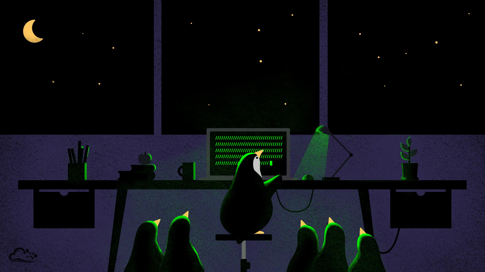

# Kisi-Kisi Praktikum POSA UAS

## Soal

1. Hak Akses
   - Buat file `index.html`.
   - Berikan hak akses file `index.html` menjadi `rwxr--r--` menggunakan `format huruf`.
2. Hak Akses
   - Buat file `style.css`.
   - Buat user baru dengan nama `Maria`.
   - Ubah user dan group dari file `style.css` menjadi `Maria`.
3. Arsip dan Kompresi
   - Apa perbedaan `arsip` dan `kompresi`.
   - Sebutkan apa saja perintah arsip dan kompresi.
4. Arsip dan Kompresi
   - Terdapat sebuah file `web.zip`.
   - Tuliskan perintah untuk mengekstrak file `web.zip`.
5. Pemrosesan File Text
   - Terdapat sebuah file `note.txt`.
   - Tuliskan perintah untuk membaca 10 baris terakhir dari file `note.txt.`
6. Pemrosesan File Text
   - Apa perbedaan `head` dan `tail`? .
   - Hitung ada berapa karakter yang muncul dari hasil perintah `who`.
7. Bantuan dan manajemen software
   - Perintah apa saja yang digunakan untuk mendapatkan bantuan di Linux.
   - Berikan contohnya untuk mendapatkan bantuan dari suatu perintah di Linux.
8. Bantuan dan manajemen software
   - Tuliskan perintah untuk meng-install VLC dari `apt`.
   - Terdapat file google_chrome.deb, tuliskan perintah meng-install file google_chrome.deb.
   - Apa yang kamu ketahui tentang: `apt`, `dpkg`, `repository`.
9. Remote login dan file transfer
   - Terdapat user `Maria` dengan IP `192.168.1.90`.
   - Tuliskan perintah untuk mengakses laptop `Maria` dan membuat file `zharonk.txt.`
10. Remote login dan file transfer
    - Pada laptop `Maria`, terdapat file `buku.pdf`.
    - Tuliskan langkah-langkah untuk menyalin file `buku.pdf` ke laptop local dengan perintah `sftp`.

## Jawaban

1. Silahkan baca tentang **Mengubah Izin Akses** di [Praktikum Lima: Atribut dan Izin Akses File dan Direktori](https://praktikum-posa.github.io/praktikum-lima/).
2. Silahkan baca tentang **Mengubah User dan Group Pemilik File** di [Praktikum Lima: Atribut dan Izin Akses File dan Direktori](https://praktikum-posa.github.io/praktikum-lima/).
3. Silahkan baca tentang **Teori Arsip dan Kompresi** di [Pertemuan Enam: Arsip File dan Sistem Kompresi](https://praktikum-posa.github.io/praktikum-enam/)
4. Silahkan baca tentang **Praktikum Arsip dan Kompresi** di [Pertemuan Enam: Arsip File dan Sistem Kompresi](https://praktikum-posa.github.io/praktikum-enam/)
5. Silahkan baca tentang **Head dan Tail** di [Pertemuan Tujuh: Pemrosesan File Text](https://praktikum-posa.github.io/praktikum-tujuh/).
6. Silahkan baca tentang **WC (Word Count)** di [Pertemuan Tujuh: Pemrosesan File Text](https://praktikum-posa.github.io/praktikum-tujuh/).
7. Silahkan baca tentang **Bantuan di Linux** di [Pertemuan Delapan: Bantuan dan Manajemen Software di Linux](https://praktikum-posa.github.io/praktikum-delapan/)
8. Silahkan baca tentang **Manajemen Software** di [Pertemuan Delapan: Bantuan dan Manajemen Software di Linux](https://praktikum-posa.github.io/praktikum-delapan/)
9. Silahkan baca tentang **Remote Login** di [Praktikum Sembilan: Remote Login, File Transfer, Remote Desktop](https://praktikum-posa.github.io/praktikum-sembilan/)
10. Silahkan baca tentang **File Transfer** di [Praktikum Sembilan: Remote Login, File Transfer, Remote Desktop](https://praktikum-posa.github.io/praktikum-sembilan/)